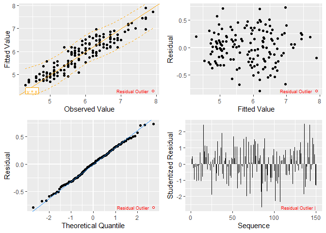

<!-- README.md is generated from README.Rmd. Please edit that file -->

# BAQM

<!-- badges: start -->

[](https://github.com/CPA-wrk/BAQM/actions/workflows/R-CMD-check.yaml)
<!-- badges: end -->

<!-- R_LIBS_USER='/Users/peter/Library/Caches/org.R-project.R/R/renv/library/BAQM-8c6b0fb8/macos/R-4.5/aarch64-apple-darwin20' -->

BAQM supplies functions developed by Babson College instructors for AQM
1000 and AQM 2000 courses using R in the curriculum. The primary
functions include:

- `stat_desc()` - a function to produce descriptive statistics for data
  frames
- `summary.lm()` - a function to summarize linear model results
- `lm_plot.4way()` - a function to produce diagnostic plots for linear
  models
- `print.summary.regsubsets()` - a function to format a “best subsets”
  report created by the `regsubsets` function from the leaps package

## Installation

You can install the development version of BAQM from
[GitHub](https://github.com/) with:

``` r
# install.packages("pak")
# pak::pak("CPA-wrk/BAQM")
```

## Example

Here are summaries of built-in R data sets `swiss` and `iris`, with

- a best-subsets analysis of modeling Fertility in `swiss` and
- a linear model with analytics of Sepal Length in `iris`.

(Variable names are truncated in `swiss` to narrow the output.)

``` r
library(leaps)
library(BAQM)
#> Registered S3 methods overwritten by 'BAQM':
#>   method                   from 
#>   print.summary.lm         stats
#>   print.summary.regsubsets leaps
#>   summary.lm               stats
names(swiss) # Show original variable names
#> [1] "Fertility"        "Agriculture"      "Examination"      "Education"       
#> [5] "Catholic"         "Infant.Mortality"
names(swiss) <- substr(names(swiss), 1, 4) # Narrows output
stat_desc(swiss)
#>           Fert   Agri   Exam   Educ   Cath   Infa
#> n.val       47     47     47     47     47     47
#> n.na         0      0      0      0      0      0
#> min         35    1.2      3      1   2.15   10.8
#> Q1        64.4   35.3     12      6   5.16     18
#> median    70.4   54.1     16      8  15.14     20
#> mean     70.14  50.66  16.49  10.98  41.14  19.94
#> Q3        79.3   67.8     22   12.5   93.4   22.2
#> max       92.5   89.7     37     53    100   26.6
#> std.dev  12.49  22.71  7.978  9.615   41.7  2.913
#
regs <- regsubsets(Fert ~ ., data = swiss, nbest = 3)
summary(regs)
#>    _k_i.best    rsq  adjr2       see    cp Agri Exam Educ Cath Infa
#> 1   1  ( 1 ) 0.4406 0.4282  9.446029 35.20              *          
#> 2   1  ( 2 ) 0.4172 0.4042  9.642000 38.48         *               
#> 3   1  ( 3 ) 0.2150 0.1976 11.189945 66.75                   *     
#> 4   2  ( 1 ) 0.5745 0.5552  8.331442 18.49              *    *     
#> 5   2  ( 2 ) 0.5648 0.5450  8.426136 19.85              *         *
#> 6   2  ( 3 ) 0.5363 0.5152  8.697447 23.83         *              *
#> 7   3  ( 1 ) 0.6625 0.6390  7.505417  8.18              *    *    *
#> 8   3  ( 2 ) 0.6423 0.6173  7.727757 11.01    *         *    *     
#> 9   3  ( 3 ) 0.6191 0.5925  7.973957 14.25         *    *         *
#> 10  4  ( 1 ) 0.6993 0.6707  7.168166  5.03    *         *    *    *
#> 11  4  ( 2 ) 0.6639 0.6319  7.579356  9.99         *    *    *    *
#> 12  4  ( 3 ) 0.6498 0.6164  7.736422 11.96    *    *    *    *     
#> 13  5  ( 1 ) 0.7067 0.6710  7.165369  6.00    *    *    *    *    *
#
stat_desc(iris) # Includes non-numeric variable
#>          Sepal.Length  Sepal.Width  Petal.Length  Petal.Width   Species
#> n.val             150          150           150          150       150
#> n.na                0            0             0            0         0
#> min               4.3            2             1          0.1  n.lvls=3
#> Q1                5.1          2.7           1.6          0.2  setos:50
#> median            5.8            3          4.35          1.3  vrscl:50
#> mean            5.843        3.057         3.758        1.199  vrgnc:50
#> Q3               6.45          3.4           5.1          1.8          
#> max               7.9          4.4           6.9          2.5          
#> std.dev        0.8281       0.4359         1.765       0.7622
#
mdl <- lm(Sepal.Length ~ ., data = iris)
summary(mdl)
#> 
#> Summary Statistics:
#>                  Value      Performance    Measure  Err(Resids)    Metric
#> Observations =     150      R-Squared =    0.86731       MAPE =  0.041785
#> F-Statistic =   188.25      Adj-R2 =       0.86271       MAD  =   0.24286
#> Pr(b's=0) =     <2e-16 ***  Std.Err.Est =  0.30683       RMSE =   0.30063
#> 
#> Analysis of Variance:
#>                Deg.Frdm  Sum.of.Sqs  Mean.Sum.Sqs  F.statistic  p-value(F)    
#> Regression            5      88.612     17.722370       188.25      <2e-16 ***
#> Error(Resids)       144      13.556      0.094142                             
#> Total               149     102.168                                           
#> 
#> Coefficients:
#>                     Coefficient  Std.Error   t-stat   p-value          VIF
#> (Intercept)             2.17127   0.279794   7.7602  1.43e-12 ***         
#> Sepal.Width             0.49589   0.086070   5.7615  4.87e-08 ***   2.2275
#> Petal.Length            0.82924   0.068528  12.1009   < 2e-16 ***  23.1616
#> Petal.Width            -0.31516   0.151196  -2.0844   0.03889 *    21.0214
#> Species_versicolor     -0.72356   0.240169  -3.0127   0.00306 **   20.4234
#> Species_virginica      -1.02350   0.333726  -3.0669   0.00258 **   39.4344
#>                                                                      
#> Signif.Levels:  0 '***' 0.001 '** ' 0.01 '*  ' 0.05 '.  ' 0.1 '   ' 1
#>                                                                 
#> Summary of   Min       1Q      Mean    Median     3Q      Max   
#> Residuals: -0.7942  -0.2187   <3e-14  0.008987  0.2025   0.731  
#>                                                   
#> Call:  lm(formula = Sepal.Length ~ ., data = iris)
#
lm_plot.lst <- lm_plot.4way(mdl)
lm_plot.lst$p_4way
```


