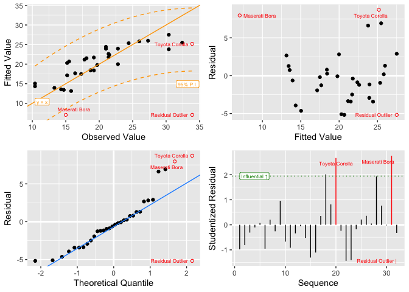

<!-- README.md is generated from README.Rmd. Please edit that file -->

# BAQM

<!-- badges: start -->
[](https://github.com/CPA-wrk/BAQM/actions/workflows/R-CMD-check.yaml)
<!-- badges: end -->

<!-- R_LIBS_USER='/Users/peter/Library/Caches/org.R-project.R/R/renv/library/BAQM-8c6b0fb8/macos/R-4.5/aarch64-apple-darwin20' -->

BAQM supplies functions developed by Babson College instructors for AQM
1000 and AQM 2000 courses using R in the curriculum. The primary
functions include:

- `stat_desc()` - a function to produce descriptive statistics for data
  frames
- `sumry.lm()` - a function to summarize linear model results
- `lm_plot.4way()` - a function to produce diagnostic plots for linear
  models
- `sumry.regsubsets()` - a function to format a “best subsets”
  regression analysis

## Installation

You can install the development version of BAQM from
[GitHub](https://github.com/) with:

``` r
# install.packages("pak")
# pak::pak("CPA-wrk/BAQM")
```

## Example

Here are summaries of the built-in R data sets ‘swiss’ and `iris`, with

- a best-subsets analysis of modeling Fertility in ‘swiss’ and
- a linear model with analytics of Sepal Length in ‘iris’.

(Variable names are truncated in ‘swiss’ to narrow the output.)

``` r
# library(BAQM)
names(swiss) # Show original variable names
#> [1] "Fertility"        "Agriculture"      "Examination"      "Education"       
#> [5] "Catholic"         "Infant.Mortality"
names(swiss) <- substr(names(swiss), 1, 4) # Narrows output
stat_desc(swiss)
#>      n.val n.na    min     Q1 median     mean    Q3    max   std.dev
#> Fert    47    0  35.00  64.40  70.40  70.1426  79.3   92.5  12.49170
#> Agri    47    0   1.20  35.30  54.10  50.6596  67.8   89.7  22.71122
#> Exam    47    0   3.00  12.00  16.00  16.4894  22.0   37.0   7.97788
#> Educ    47    0   1.00   6.00   8.00  10.9787  12.5   53.0   9.61541
#> Cath    47    0   2.15   5.16  15.14  41.1438  93.4  100.0  41.70485
#> Infa    47    0  10.80  18.00  20.00  19.9426  22.2   26.6   2.91270
#
regs <- leaps::regsubsets(Fert ~ ., data = swiss, nbest = 3)
sumry(regs)
#> sumry:  regsubsets
#>    k___best      rsq    adjr2      see       cp Agri Exam Educ Cath Infa
#> 1  1  ( 1 ) 0.440616 0.428185  9.44603 35.20490              *          
#> 2  1  ( 2 ) 0.417164 0.404213  9.64200 38.48349         *               
#> 3  1  ( 3 ) 0.215004 0.197559 11.18995 66.74667                   *     
#> 4  2  ( 1 ) 0.574507 0.555167  8.33144 18.48616              *    *     
#> 5  2  ( 2 ) 0.564780 0.544997  8.42614 19.84606              *         *
#> 6  2  ( 3 ) 0.536302 0.515224  8.69745 23.82749         *              *
#> 7  3  ( 1 ) 0.662544 0.639000  7.50542  8.17816              *    *    *
#> 8  3  ( 2 ) 0.642254 0.617295  7.72776 11.01477    *         *    *     
#> 9  3  ( 3 ) 0.619096 0.592521  7.97396 14.25240         *    *         *
#> 10 4  ( 1 ) 0.699348 0.670714  7.16817  5.03280    *         *    *    *
#> 11 4  ( 2 ) 0.663865 0.631853  7.57936  9.99340         *    *    *    *
#> 12 4  ( 3 ) 0.649790 0.616436  7.73642 11.96125    *    *    *    *     
#> 13 5  ( 1 ) 0.706735 0.670971  7.16537  6.00000    *    *    *    *    *
#
stat_desc(iris) # Includes non-numeric variable
#>              n.val n.na  min   Q1 median     mean    Q3  max   std.dev
#> Sepal.Length   150    0  4.3  5.1   5.80  5.84333  6.45  7.9  0.828066
#> Sepal.Width    150    0  2.0  2.7   3.00  3.05733  3.40  4.4  0.435866
#> Petal.Length   150    0  1.0  1.6   4.35  3.75800  5.10  6.9  1.765298
#> Petal.Width    150    0  0.1  0.2   1.30  1.19933  1.80  2.5  0.762238
#> Species        150    0 setosa: 50, versicolor: 50, virginica: 50
#
mdl <- lm(Sepal.Length ~ ., data = iris)
sumry(mdl)
#> sumry:  lm 
#> 
#> Summary Statistics:
#>                  Value      Performance    Measure  Err(Resids)    Metric
#> Observations =     150      R-Squared =    0.86731       MAPE =  0.041785
#> F-Statistic =   188.25      Adj-R2 =       0.86271       MAD  =   0.24286
#> Pr(b's=0),% =   <2e-16 ***  Std.Err.Est =  0.30683       RMSE =   0.30063
#> 
#> Analysis of Variance:
#>                Deg.Frdm  Sum.of.Sqs  Mean.Sum.Sqs  F.statistic  p-value(F)    
#> Regression            5      88.612     17.722370       188.25      <2e-16 ***
#> Error(Resids)       144      13.556      0.094142                             
#> Total               149     102.168                                           
#> 
#> Coefficients:
#>                     Coefficient  Std.Error   t-stat   p-value          VIF
#> (Intercept)             2.17127   0.279794   7.7602  1.43e-12 ***         
#> Sepal.Width             0.49589   0.086070   5.7615  4.87e-08 ***   2.2275
#> Petal.Length            0.82924   0.068528  12.1009   < 2e-16 ***  23.1616
#> Petal.Width            -0.31516   0.151196  -2.0844   0.03889 *    21.0214
#> Species_versicolor     -0.72356   0.240169  -3.0127   0.00306 **   20.4234
#> Species_virginica      -1.02350   0.333726  -3.0669   0.00258 **   39.4344
#>                                                                      
#> Signif.Levels:  0 '***' 0.001 '** ' 0.01 '*  ' 0.05 '.  ' 0.1 '   ' 1
#>                                                                                
#>                         Min          1Q         Mean       Median        3Q    
#> Residuals summary:   -0.794236   -0.218743    <3.2e-14   0.00898723   0.202546 
#>                                
#>                         Max    
#> Residuals summary:    0.731034 
#>                                                   
#> Call:  lm(formula = Sepal.Length ~ ., data = iris)
lm_plot.4way(mdl)
```


